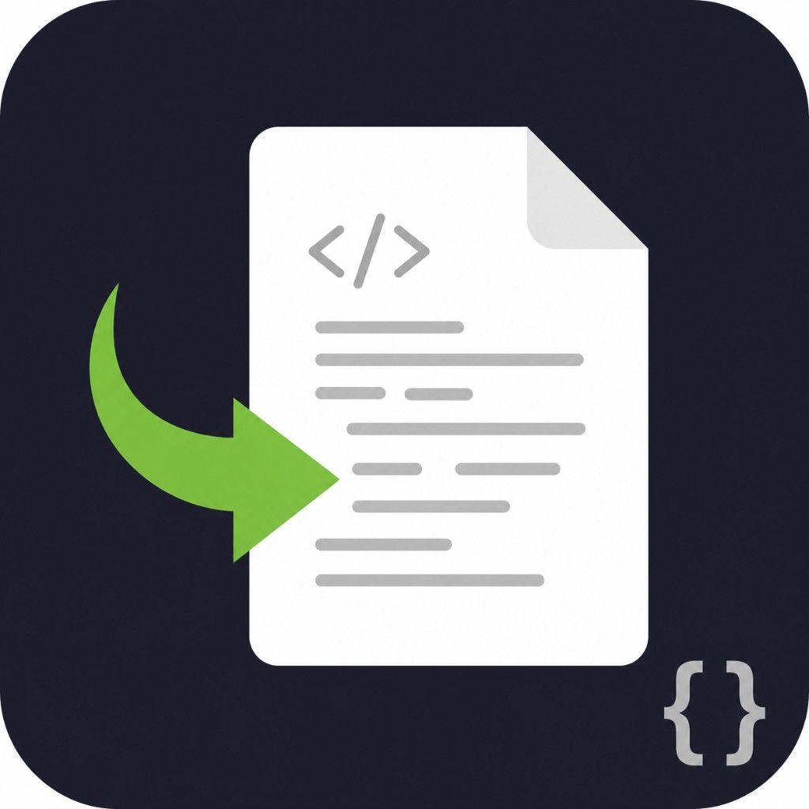

# ioBroker.autodoc

Automatically generates structured documentation (HTML, Markdown, JSON) for your ioBroker installation — on demand, on a schedule, or when the system changes.

**Version:** 0.9.37

| | |
| --- | --- |
| **Install** | [ioBroker Admin](https://www.iobroker.net/#en/documentation) — [npm](https://www.npmjs.com/package/iobroker.autodoc) package **`iobroker.autodoc`**, or install from this **Git** repository (URL / clone). Default adapter lists still need the package in [ioBroker.repositories](https://github.com/ioBroker/ioBroker.repositories) (see [TODO — release](TODO.md#release-veroeffentlichung)). |
| **Repository** | [github.com/crunchip77/ioBroker.autodoc](https://github.com/crunchip77/ioBroker.autodoc) |
| **Issues** | [GitHub Issues](https://github.com/crunchip77/ioBroker.autodoc/issues) |

**CI:** 

## Description

The adapter scans adapters, hosts, rooms, functions, scripts, aliases, userdata, and related metadata, then writes **three profiles** in one run:

| Profile | Audience | Focus |
| --- | --- | --- |
| **Admin** | Operators | Instances, hosts, resources, scripts, maintenance hints, diagnosis |
| **User** | Household | Rooms, devices, automations in plain language |
| **Onboarding** | Guests | Welcome, capabilities, QR / link to the latest HTML |

Exports are written under `/files/autodoc.<instance>/` (latest HTML + rotated timestamped `.md` / `.html` / `.json`). Optional notifications and **opt-in AI** text (separate providers) can enrich the docs.

## Requirements

- **Node.js** ≥ 22 (see `package.json` → `engines`)
- **ioBroker.js-controller** ≥ 6.0.11 (declared in `io-package.json` → `common.dependencies`)
- **ioBroker Admin** ≥ 7.6.20 (declared in `io-package.json` → `common.globalDependencies`) — needed for the **json** configuration UI and `jsonConfig` features (e.g. `textSendTo`, collapsible panels)

No other adapters are **required** for AutoDoc itself. Optional: a **web server** adapter if you want to open generated files from outside the Admin file browser; exports are always available under `/files/autodoc.<instance>/`. **PDF** profiles need the optional npm package **`puppeteer`** (bundled Chromium) installed in the adapter directory — see **Optional PDF export** below.

## Configuration

Configure the instance in **ioBroker Admin** (tabs for basics, manual notes, advanced options, notifications, AI). Generation can be triggered manually, on startup, on a timer, and after adapter changes (debounced).

Short **orientation** for operators (install paths, tabs, exports, hashes, checker): **[`docs/user-guide/README.md`](docs/user-guide/README.md)** · **German** scenario walkthrough (**„Muster-Einfamilienhaus“** etc.): **[`docs/user-guide/README.de.md`](docs/user-guide/README.de.md)**.

Useful **states** (selection): `action.generate`; **`action.exportPdf`** (writes **PDF** profiles from the latest HTML under `/files` when optional **`puppeteer`** is installed in the adapter directory — no full regeneration); `info.lastGeneration` / `info.nextGeneration`; `info.htmlUrlAdmin` / `info.htmlUrlUser` / `info.htmlUrlOnboarding`; `info.templateVersion` (HTML template / renderer alignment); `info.forumCardPlain` (plaintext “system card” for forums, updated when documentation is generated).

**Exports & storage:** after each successful run, **`documentation.exportHashes`** holds **SHA-256 (hex)** for the latest MD / JSON / Admin HTML served from `/files`, and **merges digests for `autodoc-{admin,user,onboarding}.pdf`** whenever a PDF export step wrote those files. In Admin **Advanced**, **Documentation states storage** is **`full`** (defaults; last bodies in `documentation.*`) or **`metadata`** (lightweight states; canonical files remain under `/files`).

### Media, Redis, and state storage (short)

- **Canonical exports** always live under **`/files/autodoc.<instance>/`** and are **overwritten** each run (no accumulation of old HTML versions there).
- If the **object / Redis** database should stay small, prefer **`metadata`** for documentation states (see **Exports & storage** above): scripts and integrations that need **full text** should read **`/files/`** or use **`info.htmlUrl*`** / download actions.
- **Photos and large binaries:** do **not** rely on storing big images in ioBroker’s virtual file storage — **especially with Redis** (binary blobs inflate RAM). Use **external URLs** (your NAS, HTTP server) or small **inline SVG** diagrams; the same guideline keeps **jsonl** setups predictable.
- Rationale, options, and future media work: [`PLAN.md` — Media (MVP) & limits](PLAN.md#architektur-medien-mvp) and [Architecture boundaries](PLAN.md#architektur-grenzen).

### Public base URL (QR code and “Copy link”)

The **Onboarding** HTML includes a QR code and a **Copy link** control. Both use the same target: the onboarding file under `/files/autodoc.<instance>/autodoc-onboarding.html`, prefixed with the **ioBroker base URL** from the adapter settings (**Advanced** tab: *ioBroker base URL (optional)*).

- Set the base URL to what you use in the browser to reach ioBroker (scheme, host, port if needed), **without** a trailing slash. Examples: `https://home.example.com:8081`, `http://192.168.1.10:8081`.
- If it is **empty or wrong**, guests scanning the QR code or using the copied link from another device may get a broken or internal-only URL. After changing it, run documentation generation again so the HTML is rebuilt.

### Optional filesystem export (Docker / NAS)

**Filesystem export path** writes the three HTML profiles to a real directory (in addition to ioBroker’s `/files/…` storage). In **Docker**, map a host folder into the container and set **export path** to the **container-side** path (not the Unraid/host path). See the field help in Admin for a short reminder.

### Optional PDF export (Puppeteer)

**Best effort:** after a successful documentation run, you can create **`autodoc-admin.pdf`**, **`autodoc-user.pdf`**, and **`autodoc-onboarding.pdf`** from the same HTML that is stored under `/files/` (headless Chromium via **`puppeteer`**, declared as an **optional** npm dependency — same major line as **`@mermaid-js/mermaid-cli`**). Enable **Generate PDF after each documentation run** in **Advanced** next to the filesystem export, or trigger **`action.exportPdf`** manually. PDFs are written under **`/files/autodoc.<instance>/`** and mirrored to **Filesystem export path** when that path is set. **Embedded Mermaid SVG** (when mmdc ran during generation) prints without extra network; **jsDelivr** client Mermaid still needs internet during the PDF step. Without a working Chromium stack, PDF creation is skipped with a clear log line — HTML/Markdown generation is unaffected.

### AI context hints (guest vs resident)

**AI context hints** are injected only into the LLM prompt; they are **not** printed in the documentation. For **guest onboarding**, prefer everyday facts. Heavy IT or project wording (adapters, repos, …) can cause the model to leak jargon into guest text; a **safety step** then replaces that AI block with neutral guest wording. That is intentional. The **resident / family** profile does not use the same guest-only restriction. Configure them in Admin under **KI documentation / AI documentation** (after enabling a provider); full wording appears in the hint above the field.

## Features (overview)

- Discovery across instances, hosts, enums, scripts, aliases, userdata, system config
- Standalone HTML per profile with search, dark mode, responsive layout
- Markdown + JSON export and version history (rotation configurable)
- Maintenance-oriented hints (documentation score for open checklist items; disabled instances listed as inventory, not penalized)
- Multilingual Admin UI strings (EN / DE / FR full; more locales with English copy until translated — [CONTRIBUTING](CONTRIBUTING.md#admin-ui-translations-i18n)); generated copy follows your configured project language where applicable
- Optional AI providers (e.g. Ollama, Groq, Anthropic) with strict opt-in

For **roadmap and planning**: [`TODO.md`](TODO.md) (open work at the top, full completed checklists in the appendix) and [`PLAN.md`](PLAN.md) (vision, rationale, architecture brainstorming).

**Contributing / releases:** see [`CONTRIBUTING.md`](CONTRIBUTING.md).

## Changelog

**Admin `common.news`** in `io-package.json` lists only versions **published on npm** (Adapter Checker **E2004**). The detailed sections below are the **user-facing** changelog (Git-era releases plus npm); older entries are in [`CHANGELOG_OLD.md`](CHANGELOG_OLD.md).

### **WORK IN PROGRESS**

- **Release prep:** Draft user-facing bullets here before **`npm run release`** (`CONTRIBUTING.md`). Open work: **[`TODO.md`](TODO.md)** · **[`PLAN.md`](PLAN.md)** · optional **PR** [ioBroker.repositories](https://github.com/ioBroker/ioBroker.repositories) when ready.

### 0.9.37 (2026-05-10)

- **Tooling:** `runPdfExport` initializes the PDF digest map with a typed empty collection so **`npm run check`** (TypeScript) passes; no change to PDF export behavior.
- **Docs:** Adapter-neutral **[`docs/iobroker-adapter-references.md`](docs/iobroker-adapter-references.md)** linked from **`TODO.md`**, **`CONTRIBUTING.md`**, and the Cursor project rule; **`PLAN.md`** phase **5.x.1** aligned with **`TODO.md`** (MVP complete).

### 0.9.36 (2026-05-09)

- **npm / Checker:** tarball **0.9.36** matches **`main`**: **`common.news`** lists only npm-published versions (fixes **E2004** stale metadata from first **0.9.35** publish). README **Version:** line synced; no adapter runtime/UI changes.

### 0.9.35 (2026-05-08)

- **npm:** publish **`iobroker.autodoc`** on the public registry so hosts can `npm install` the adapter tarball without cloning.
- **README:** install table reflects **npm** plus Git; default-list installs still depend on **ioBroker.repositories** (unchanged process).

### 0.9.34 (2026-05-08)

- **`documentation.exportHashes`:** after a successful PDF step, **SHA-256** entries for **`autodoc-admin.pdf`**, **`autodoc-user.pdf`**, **`autodoc-onboarding.pdf`** are merged into the same state (generation with **`pdfExportAfterGeneration`** or manual **`action.exportPdf`**).
- **Mermaid / HTML:** jsDelivr **`mermaid.min.js`** is injected **only** when the page still contains **`<pre class="mermaid">`** (fully SVG-embedded exports skip the CDN). `RENDERER_VERSION` **2026.05.08.1**.
- **Admin:** **`Doc layout pdf hint`** on tab **HTML export & extra sections**; **export-hashes** help text mentions PDF digests; **`manualMermaidDiagram`** help clarified.
- **Quick Start:** scripts-with-description lines are ordered **by name** for stable output.
- **`docs/user-guide`:** tab overview, **exportHashes**/Mermaid wording; **SCREENSHOTS.md** + eingebettete **PNG-Screenshots** für alle sechs Konfig-Tabs (neben den SVG-Wireframes), Hinweise Lesbarkeit/GitHub-Vorschau.

### 0.9.33 (2026-05-08)

- **PDF export (Phase 5 — first slice):** optional **`puppeteer`** — **`pdfExportAfterGeneration`** in Admin **Advanced** and/or **`action.exportPdf`**; writes **`autodoc-{admin,user,onboarding}.pdf`** alongside HTML under **`/files/`** and mirrors to **Filesystem export path** when set (`lib/htmlToPdf.js`). Same Chromium sandbox flags as Mermaid CLI. Without **`puppeteer`** or on broken headless setups, PDF is skipped; core documentation generation continues.
- **Admin:** **`jsonConfig`** + **i18n** (EN/DE/FR + English copy elsewhere) for PDF options and extended **export path** hint.

## License

MIT License

Copyright (c) 2026 crunchip77 <41550245+crunchip77@users.noreply.github.com>
