# AutoDoc — Konfiguration der Instanz (Wiki)

Diese Seite richtet sich an **Betreuer** und **Haus-Admins**, die die **AutoDoc-Instanz** im ioBroker-Admin einrichten: Sie beschreibt die **Registerkarten**, was dort typischerweise eingetragen wird, und zeigt **Screenshots** zur Orientierung.  

Die **Inline-Hilfe** bei jedem Feld im Admin (`jsonConfig`) bleibt die **fachliche Referenz** — diese Datei ergänzt sie um **Überblick, Bilder und ein Übungsszenario**.

**Technische Grundlagen** (Systemvoraussetzungen, Projektbeschreibung) und **Copy-Paste-Beispiele** für **Mermaid**, **JSON-Felder** und **HTML-Schrift/CSS**: englisches Haupt-[README](../../README.md) mit den Abschnitten [**Mermaid cookbook examples**](../../README.md#mermaid-cookbook-examples), [**JSON cookbook snippets**](../../README.md#json-cookbook-snippets) und [**HTML export — custom font & CSS**](../../README.md#html-custom-css-examples).

**Stabile GitHub-Links** (nach Merge auf `main`, z. B. für Lesezeichen aus der Inline-Hilfe):

- [Mermaid-Kochbuch](https://github.com/crunchip77/ioBroker.autodoc/blob/main/README.md#mermaid-cookbook-examples)
- [JSON-Kochbuch](https://github.com/crunchip77/ioBroker.autodoc/blob/main/README.md#json-cookbook-snippets)
- [HTML — Schrift & CSS](https://github.com/crunchip77/ioBroker.autodoc/blob/main/README.md#html-custom-css-examples)
- [Dokumentationssprache & Deltas](https://github.com/crunchip77/ioBroker.autodoc/blob/main/README.md#documentation-instance-overview)
- [Öffentliche Basis-URL / QR](https://github.com/crunchip77/ioBroker.autodoc/blob/main/README.md#public-base-url)
- [PDF-Export (Puppeteer)](https://github.com/crunchip77/ioBroker.autodoc/blob/main/README.md#optional-pdf-export-puppeteer)

**Instanz öffnen:** **Instanzen** → Ihre AutoDoc-Instanz → **Schraubenschlüssel** (Konfiguration).

**Zu den Bildern:** Wo ein **SVG** steht, beschreibt es die **Tab-Struktur** schematisch; der **Screenshot** darunter zeigt dieselbe Stelle in der **echten Oberfläche** (Demo). In GitHub wirken Vorschauen oft klein — Bild in neuem Tab öffnen oder zoomen. Hinweise zu **Aufnahmen, Verpixelung und Datenschutz** sowie **wann neue Screenshots nötig sind**: **[`SCREENSHOTS.md`](assets/SCREENSHOTS.md)**.

---

## Kurz vom Haupt-README (Betrieb)

- **Dokumentationssprache** (Grundeinstellungen): steuert Überschriften und feste Texte in **allen HTML-Profilen** und im Markdown; auch die **Kurzzeilen** für Inventarvergleich („changes since last run“) und für **Changelog**-Karten beim erneuten Erzeugen — ältere gespeicherte Changelog-Zeilen erscheinen in der **aktuellen** Export-Sprache. Details: [**documentation-instance-overview**](../../README.md#documentation-instance-overview).
- **Erweitert → Ausblenden „Änderungen seit letztem Lauf“** (`hideAdminDeltaSinceLastRun`): blendet nur die **gelbe Delta-Box** in der **Admin**-HTML-Systemübersicht und den passenden Block im **Admin**-Markdown aus; **Changelog-Kapitel**, User und Onboarding bleiben unverändert.
- **User/Familie**: bei **echten** Inventaränderungen seit dem letzten Schnappschuss (nicht beim ersten Lauf) erscheint ein kurzer **Alltagssatz** unter dem Titelblock — **Onboarding** nicht.
- **Basis-URL / QR / „Link kopieren“**: dieselbe Einstellung wie der Browser-Zugang zum Admin, **ohne** Slash am Ende; nach Änderung **Dokumentation erzeugen**. Ausführlich: [**Public base URL**](../../README.md#public-base-url).
- **PDF**: optional **`puppeteer`** im **Adapterverzeichnis**; Schalter unter **Erweitert** oder Datenpunkt **`action.exportPdf`**. Siehe [**Optional PDF export**](../../README.md#optional-pdf-export-puppeteer).
- **Dateisystem-Export / Docker**: Host-Ordner einbinden und im Adapter den **Container-Pfad** eintragen — Kurzhinweis auch in der Feldhilfe.
- **Große Bilder / Redis:** Große Bilder oder Binärdateien **nicht** als **State-Werte** in der **Objektdatenbank** ablegen — bei Backend **Redis** treiben große Blobs den RAM hoch. Lieber **externe URLs** oder kleine **SVG**. AutoDoc legt Volltext ohnehin nur unter **`/files/`** ab; **`documentation.markdown` / `.html` / `.json`** sind **kurze Platzhalter** (kein Ersatz für Medienspeicher) — siehe [PLAN.md — Medien (MVP)](../../PLAN.md#architektur-medien-mvp).

---

## Registerkarten — was gehört wohin?

1. **Grundeinstellungen** — **Projektname** und **Dokumentationssprache** (alle Exporte); welches **Markdown-Profil** standardmäßig erzeugt wird; **wann** neu generiert wird (Start, Zeitplan, Adapteränderungen).
2. **Meine Dokumentation** — **Leser-Texte** für Familie und Gäste (Notizen, Abläufe, Playbook); optionale **Notfall-Kurzzeilen**; optional **Mermaid** und **Auto-Host-Topologie**; Filter „was ausblenden“ für User vs. Onboarding.
3. **Erweitert** — **Basis-URL** für QR/Links; Grenzen (z. B. nur aktivierte Instanzen); **Export nach Dateisystem**; optional **PDF**; **Doku-Setup-Score**; Hinweis: volle Exporte liegen unter **`/files`**, States nur Platzhalter.
4. **HTML-Export & Zusatzkapitel** — **Erscheinungsbild** (Theme, Logo); **Kapitelreihenfolge und Ausblenden** je Profil (**JSON**); **eigene Markdown-Kapitel** (`customDocSectionsJson`); optional **Schriftart** (`htmlFontStack`) und **zusätzliches CSS** (`htmlExtraCss`, nur exportiertes HTML) — Beispiele und Selektoren: [**HTML — Schrift & CSS**](../../README.md#html-custom-css-examples); Verweis auf PDF-Schalter unter **Erweitert**.
5. **Benachrichtigungen** — optional Nachricht nach erfolgreicher Generierung (abhängig vom Messaging-Adapter).
6. **KI-Dokumentation** — nur relevant, wenn ein **Anbieter aktiv** ist; sonst bleiben die Felder ohne KI-Wirkung.

Nach inhaltlichen Änderungen: **Dokumentation generieren** (Button oder Datenpunkt **`action.generate`**) auslösen oder den eingestellten Timer abwarten.

---

## Screenshots der Tabs

**SVG + PNG gehören zusammen:** Schema zuerst, dann reales UI (Demo-Instanz; Layout kann je nach Admin-Version variieren).

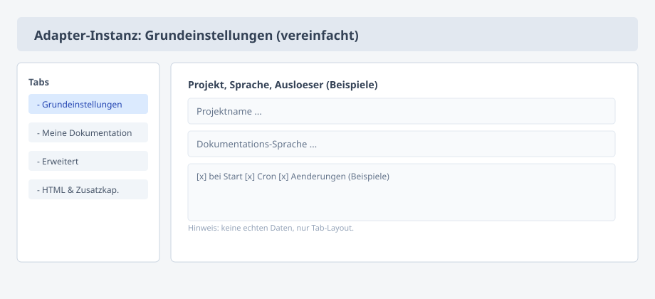

*Echte Admin-Oberfläche (Demo-Instanz; je nach Theme/Version abweichend):*

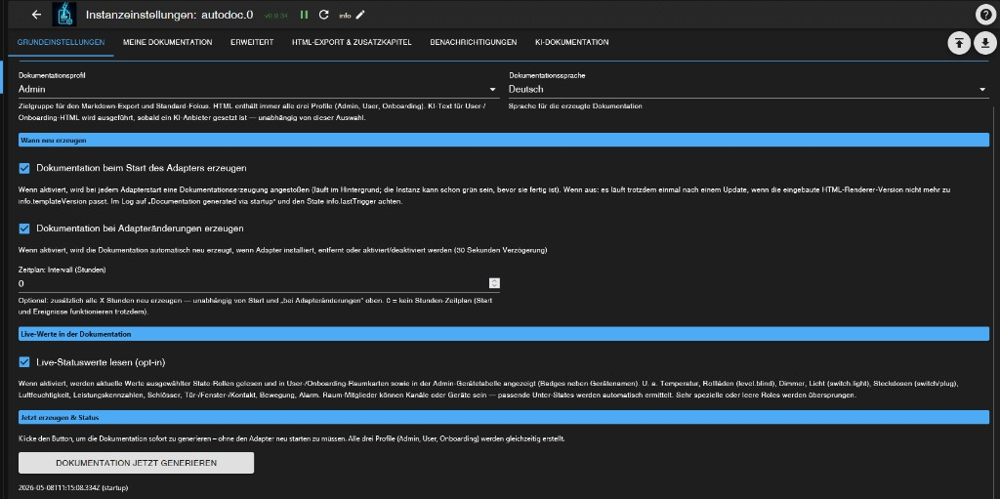

*Aufnahme: AutoDoc **0.9.39**, ioBroker Admin **≥ 7.6.20** (Stand **2026-05**).*

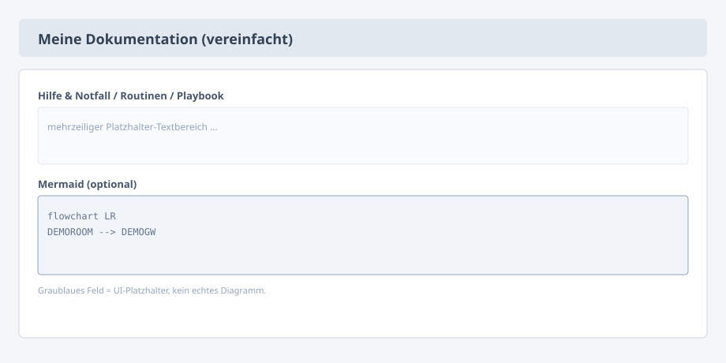

*Echte Admin-Oberfläche — **Meine Dokumentation** ist ein langer Scroll; vier Screenshots **von oben nach unten** (Demo):*

**1/4 —** Projekt, Kontakt & Hinweise; Hilfe & Abläufe (Klartext).

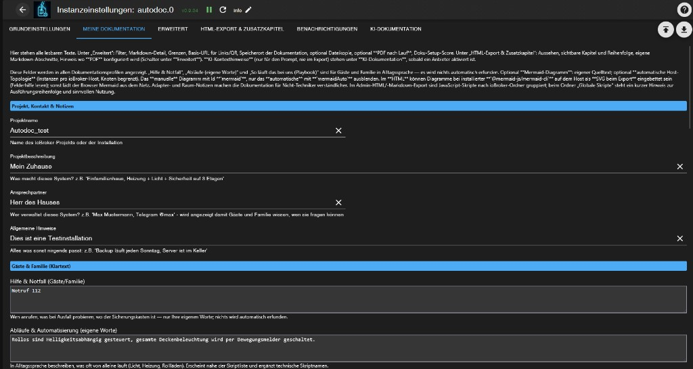

*Aufnahme: AutoDoc **0.9.39**, ioBroker Admin **≥ 7.6.20** (Stand **2026-05**).*

**2/4 —** Playbook, optionales **Mermaid**-Diagramm, automatische Host-Topologie, Notfall-Kurzzeilen (WLAN/Strom/Wasser).

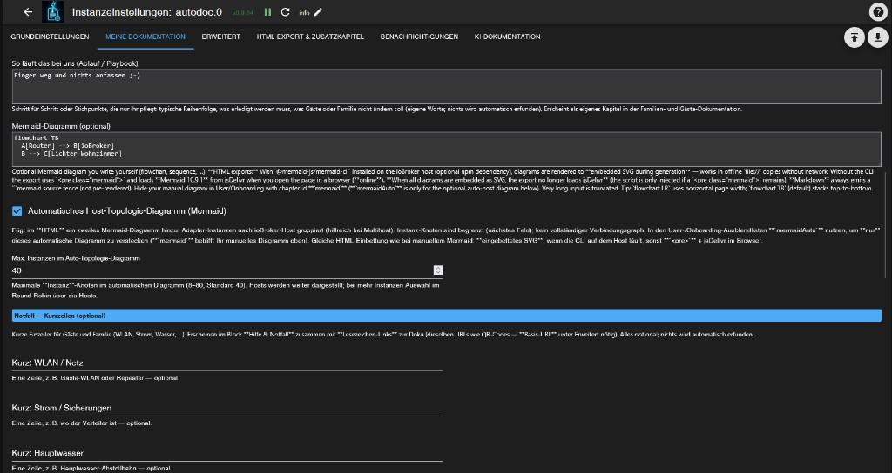

*Aufnahme: AutoDoc **0.9.39**, ioBroker Admin **≥ 7.6.20** (Stand **2026-05**).*

**3/4 —** Kurzzeile Sonstiges (optional); Adapter- und Raum-Notizen.

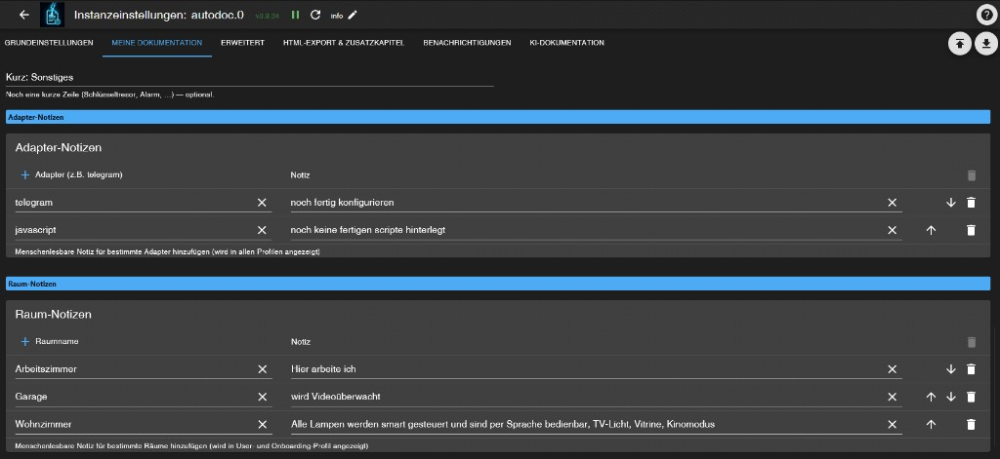

*Aufnahme: AutoDoc **0.9.39**, ioBroker Admin **≥ 7.6.20** (Stand **2026-05**).*

**4/4 —** Räume/Adapter pro Profil ausblenden (Onboarding vs. User/Familie); Anzeige interner JavaScript-Dateinamen für Gäste.

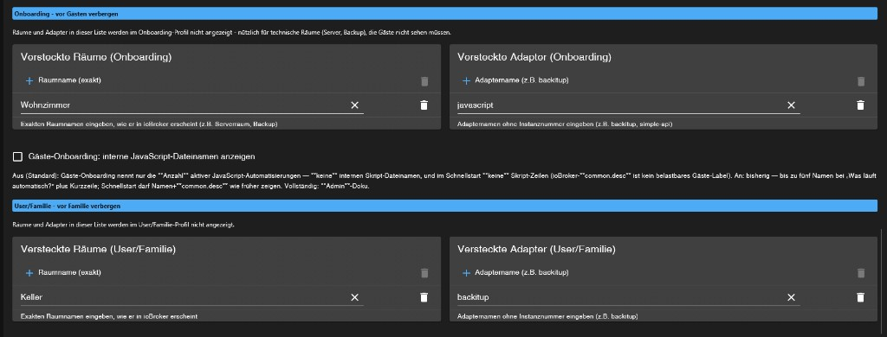

*Aufnahme: AutoDoc **0.9.39**, ioBroker Admin **≥ 7.6.20** (Stand **2026-05**).*

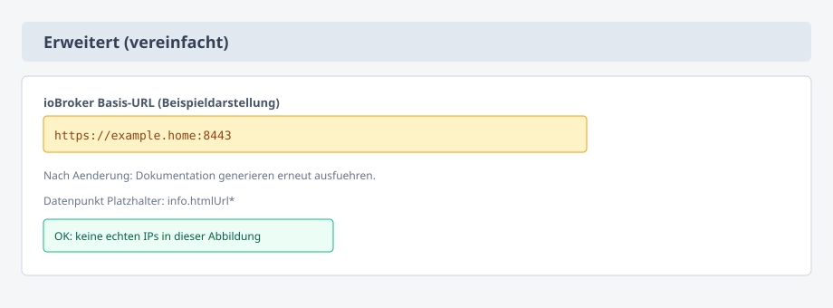

*Echte Admin-Oberfläche — Tab **Erweitert**, langer Scroll; zwei Screenshots **von oben nach unten** (Demo; **Basis-URL** und Exportpfade nur **Beispiele**):*

**1/2 —** Inhalt & Grenzen; **Exporte in Dateien** (Platzhalter in `documentation.*`); optionale **Basis-URL**.

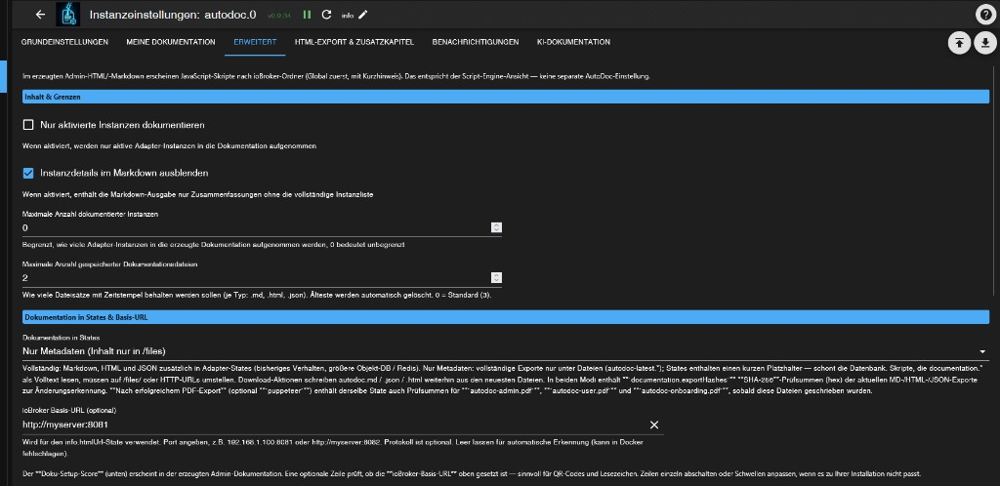

*Aufnahme: AutoDoc **0.9.39**, ioBroker Admin **≥ 7.6.20** (Stand **2026-05**).*

**2/2 —** **Doku-Setup-Score**; optionaler **Dateisystem-Export**; **PDF nach jedem Lauf** (Puppeteer/Chromium).

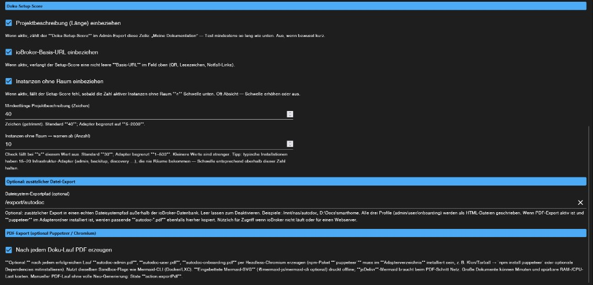

*Aufnahme: AutoDoc **0.9.39**, ioBroker Admin **≥ 7.6.20** (Stand **2026-05**).*

*Echte Admin-Oberfläche — Tab **HTML-Export & Zusatzkapitel**, drei Screenshots **von oben nach unten** (Demo). Im Einleitungstext Hinweis auf **PDF** (Schalter unter **Erweitert**). Für öffentliche Repos: Logo-URLs und Mustertexte in **eigenen** Zusatzkapiteln durch **generische Beispiele** ersetzen.*

**1/3 —** Darstellung: **Farbschema** & **Preset** (HTML), optionale **Logo-URL** (Seitenleiste).

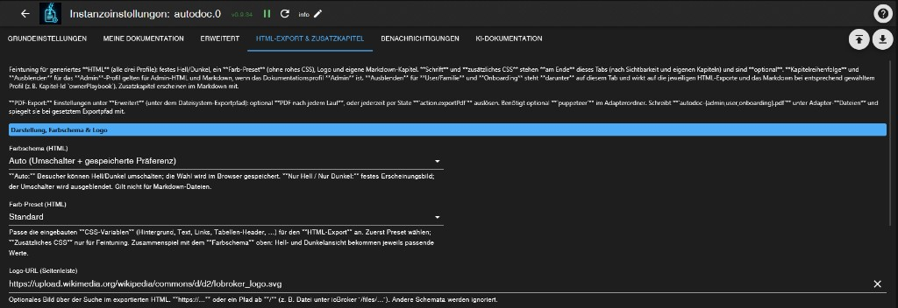

*Aufnahme: AutoDoc **0.9.39**, ioBroker Admin **≥ 7.6.20** (Stand **2026-05**).*

**2/3 —** **Admin**: Kapitel-Reihenfolge & ausgeblendete Kapitel (**JSON**). **User/Familie**: ausgeblendete Kapitel & Reihenfolge (**JSON**).

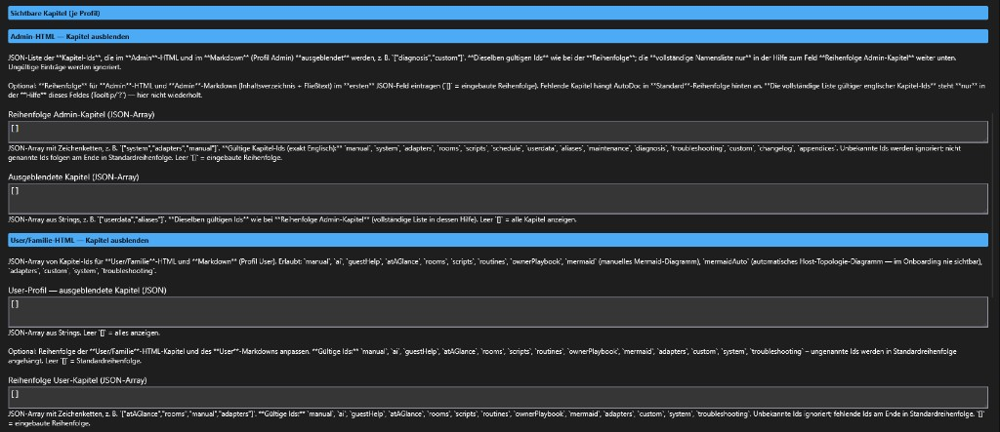

*Aufnahme: AutoDoc **0.9.39**, ioBroker Admin **≥ 7.6.20** (Stand **2026-05**).*

**3/3 —** **Onboarding**: ausgeblendete Kapitel & Reihenfolge (**JSON**); **eigene Markdown-Kapitel** (**JSON**-Objekte); unten Hinweis auf optionale Schrift/zusätzliches CSS.

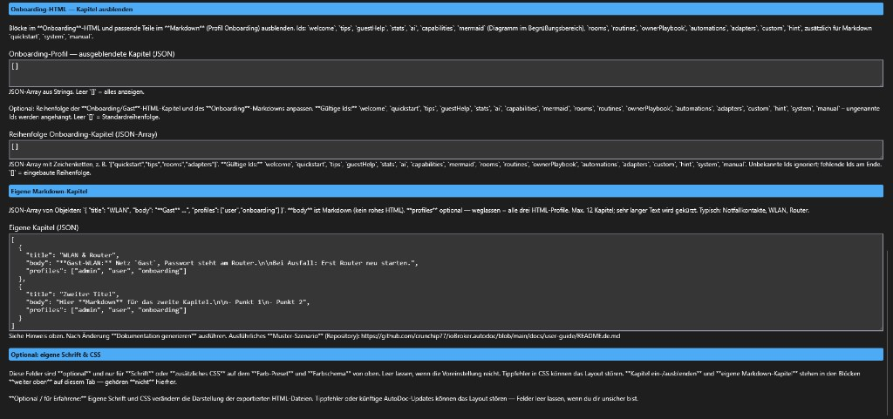

*Aufnahme: AutoDoc **0.9.39**, ioBroker Admin **≥ 7.6.20** (Stand **2026-05**).*

*Echte Admin-Oberfläche — Tab **Benachrichtigungen** (optional; bei Bedarf **überspringen**). **Instanznamen**, Empfänger und Vorlagen in **öffentlichen Repos** nur mit **Platzhaltern** ausfüllen oder weglassen.*

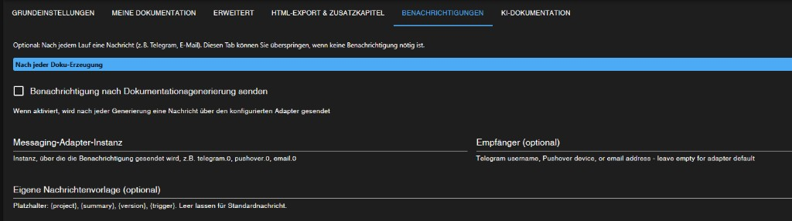

*Aufnahme: AutoDoc **0.9.39**, ioBroker Admin **≥ 7.6.20** (Stand **2026-05**).*

*Echte Admin-Oberfläche — Tab **KI-Dokumentation**, langer Scroll; **zwei Screenshots von oben nach unten** (Demo). Die **Datenschutz-** und **Hardware-Hinweise** im UI sind Bestandteil des Adapters — Cloud‑Anbieter nur nutzen, wenn das für euch passt.*

**1/2 —** Anbieter & Modell, **Ollama-Basis-URL**, Anfrage‑Timeout.

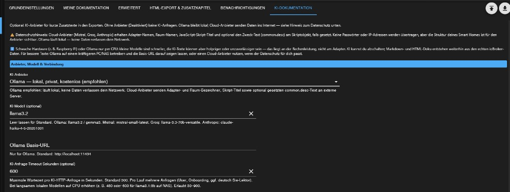

*Aufnahme: AutoDoc **0.9.39**, ioBroker Admin **≥ 7.6.20** (Stand **2026-05**).*

**2/2 —** **KI-Kontexthinweise** (nur für die Anfrage); **Temperatur**; Opt-in **„KI erklärt JavaScript-Skripte“**.

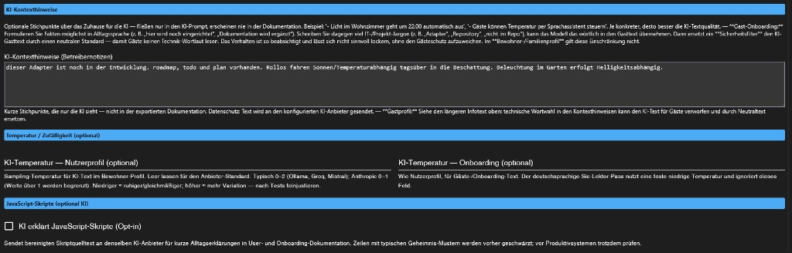

*Aufnahme: AutoDoc **0.9.39**, ioBroker Admin **≥ 7.6.20** (Stand **2026-05**).*

---

## Wo liegen die fertigen Exporte?

- Alle Profile (Admin-/User-/Onboarding-HTML, Markdown, JSON) unter **`/files/autodoc.<instanz>/`**, u. a. `autodoc-latest.*` und bei Bedarf **ältere** zeitgestempelte Dateien.
- Datenpunkte z. B. **`info.htmlUrlAdmin`** / **`User`** / **`Onboarding`**, **`info.lastGeneration`**.
- **`documentation.exportHashes`** — SHA‑256‑Hex der „latest“-Exporte (Markdown, Admin-HTML, JSON); nach **PDF**-Lauf zusätzlich die **`autodoc-*.pdf`**.

**Speicherlayout:** Volltext liegt **nur** unter **`/files`**; **`documentation.*`-States** sind **kurze Platzhalter** (Stand Adapter **0.9.39**). Wer Automatisierung anbindet: Volltext aus **`/files`**, **`info.htmlUrl*`** oder Download-Aktionen lesen.

---

## Übungsszenario: „Muster-Einfamilienhaus“

> **Nur Übung:** Alle Werte sind **frei erfunden**. Keine echten **Adressen**, **WLAN-Schlüssel**, **internen IPs**, **Forum-Karten** oder Produktiv-Zugänge in Screenshots oder Git übernehmen — lieber **Platzhalter** und eigene Notizen **lokal** pflegen.

**Ausganglage:** Zweistöckiges Einfamilienhaus mit ioBroker (**Heizszenen**, Licht u. a. in **Wohnzimmer**, **Treppenhaus**, Kinderzimmer), ergänzend z. B. Rauchmelder oder KNX — es geht um **nachvollziehbare Beispieltexte**, nicht um echte Hausdaten.

### Schritt 1 — Basis

- Projektbezeichnung: z. B. **„Musterhaus Schulweg“** (keine echte Anschrift).
- Dokumentationssprache: **DE**.
- Nach Änderungen mindestens einmal **Dokumentation erzeugen**.

### Schritt 2 — Gäste & Familie (Tab „Meine Dokumentation“)

- **`guestHelpNote`**: Stichworte (**Notfallkontakt**, **Sicherungen**, **Gäste-WLAN getrennt vom Hauptnetz** — nur das, was ihr wirklich so dokumentieren wollt).
- Optional **Kurzzeilen** WLAN/Strom/Wasser.
- **`ownerPlaybookNote`**: wenige Stichpunkte aus dem Alltag (z. B. **Warmwasser** erst nach …).
- Felder dürfen **leer** bleiben — ohne eure Texte füllt sich nichts von alleine.

### Schritt 3 — QR & Link (Tab **Erweitert**)

**Basis-URL** = genau die Adresse, mit der **ihr** den Admin im Browser öffnet (**https://…** oder **http://host:8081**), **ohne** Schrägstrich am Ende. Danach wieder **Dokumentation erzeugen**. Test zuerst im **Heim-WLAN**, nicht öffentlich exponieren. Ausführlicher: Haupt-[README → Public base URL](../../README.md#public-base-url).

### Schritt 4 — Zusätzliches Markdown-Kapitel (Tab **HTML … & Zusatzkapitel** → **Custom sections**, **`customDocSectionsJson`**)

Im Feld: gültiges **JSON-Array** mit Objekten `title`, `body`, optional `profiles` — Platzhalter und Hilfetext im Admin beachten.

**Weitere Beispiele** (Reihenfolgen, Ausblenden, zweites Mermaid-Muster): Haupt-[README](../../README.md) → [**JSON cookbook snippets**](../../README.md#json-cookbook-snippets), [**Mermaid cookbook**](../../README.md#mermaid-cookbook-examples).

```json
[
  {
    "title": "Musterhilfe Gast-WLAN",
    "body": "Beispieldaten: Hier steht später _Ihr_echter Hinweistext (Markdown)._",
    "profiles": ["onboarding", "user"]
  }
]
```

Maximal **12** Einträge; sehr lange Texte werden beim Erzeugen gekürzt.

### Schritt 5 — Optional Mermaid (Tab **„Meine Dokumentation“**)

Platzhalter im Feld überschreiben. **Copy-Paste-Diagramme:** [**Mermaid cookbook examples**](../../README.md#mermaid-cookbook-examples).

Mit installierter **Mermaid-CLI** werden Diagramme als **SVG** ins HTML eingebettet (offlinefreundlich). Ohne CLI oder bei Fehler bleibt `<pre class="mermaid">` und der Browser kann **jsDelivr** laden — siehe Admin-Hilfe.

**Ausblenden:** Kapitel-IDs **`mermaid`** (manuell) und **`mermaidAuto`** (nur Auto-Host-Graph) in den jeweiligen **Ausblenden**-Listen.

### Schritt 6 — Kapitelreihenfolge oder ausblenden

Standard belassen: **`[]`** in den JSON-Feldern. **Mustervorlagen:** [**JSON cookbook snippets**](../../README.md#json-cookbook-snippets).

Nach Änderungen: **Dokumentation erzeugen** und einen Export-Link (`info.*Url*`) kurz prüfen.

### Schritt 7 — Optional: Schrift & zusätzliches CSS

Nur für den **HTML**-Export (Tab **HTML-Export & Zusatzkapitel**, Bereich **Optional: eigene Schrift & CSS**). Die **Tooltips** (`?`) enthalten **Copy-Paste-Starter**; Hintergrund und Selektoren (`nav`, `nav ul li a`, …): Haupt-[README → HTML Schrift & CSS](../../README.md#html-custom-css-examples). Nach Änderung wieder **Dokumentation erzeugen**.
